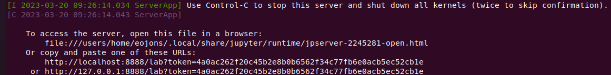
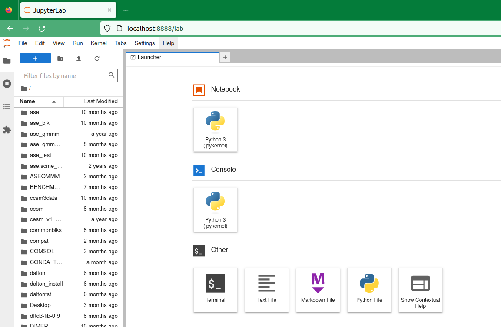

# Jupyterlab on Elja

These instructions show you how to set up a **non-browser** based Jupyterlab on a compute node,
and how to connect to it with a browser on your local computer. This is accomplished in four steps.

The following instructions work on a Unix/MacOS system. Remember to change **<uname\>** to 
your username.

### 1) Set up Jupyterlab with Conda:

Log into Elja and set up your **jupyterlab** environment using **conda**. 

```bash
[..]$ module load Anaconda3/2022.05
[..]$ conda create -y -p $HOME/conda/env_jupyter
[..]$ conda activate $HOME/conda/env_jupyter
[..]$ conda install -c conda-forge jupyterlab
```

:::note
It is important to run all package compilations on the **log-in node** before deploying this environment on the **compute nodes**.
:::

In this example **Python** and **tsne** python package are built in the **jupyterlab** environment

```bash
[..]$ conda install python=3.9
[..]$ pip install --upgrade pip wheel setuptools
[..]$ pip install jupyter
[..]$ conda install -c conda-forge tsne
```

### 2) Open an Interactive Session and Deploy Jupterlab Notebook

In this example 24 cores of a compute node from partition **<pname\>** is requested with 3.9**Gb** per core.

```bash
$ srun --job-name "Jupyterlab" --partition <pname> --cpus-per-task 24 --mem-per-cpu 3900 --time 1-00:00:00 --pty bash
```

:::note
It is important to adjust the number of cores (and memory per core) according to your needs! Don't allocate unnecessary processing power. See [here](./hardware/01_partitions.md) for partitions and specs.
:::

Activate the **jupyterlab** environment
```bash
[<uname>@compute-\#]$ module load Anaconda/2022.05
[<uname>@compute-\#]$ conda activate $HOME/conda/env_jupyter
```

Deploy a **jupyterlab notebook** on the node, with no browser
```bash
[<uname>@compute-\#]$ jupyter-lab --port 8888 --no-browser
```

There will be a lot of output, but the important output is the second to last **jupyterlab url** underlined here:



### 3) Establish a Tunnel to the Compute Node

Open up a new terminal window on your local computer and establish a double tunnel 

```bash                                                                    
[..]$ ssh -t -t <uname>@elja.hi.is -L 8888:localhost:8888 ssh compute-\# -L 8888:localhost:8888
```

Note that **compute-\#** must match the name and number of the compute node allocated for the interactive run.

Leave the terminal window open, and open up a browser on your local computer.

### 4) Open Jupyterlab-Notebook on your Local Computer

You can now open up a browser on your local computer, and copy-paster the the **jupyterlab url** into your browser:


Press enter, and your **jupyterlab notebook**, running on the compute node, is now active in your local browser:



:::note
It can happen that the port **8888** is occupied somewhere along the double tunnel. In this case simply choose another (similar) port number, for example **8889**, and start again with activating a **jupyter-lab notebook**, last part of step **2)**, followed by a repeat of steps **3)** and **4)**.
:::


