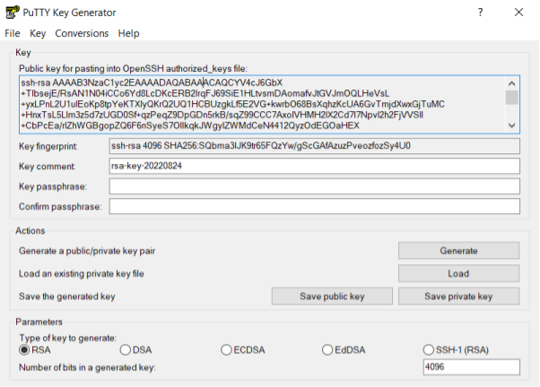
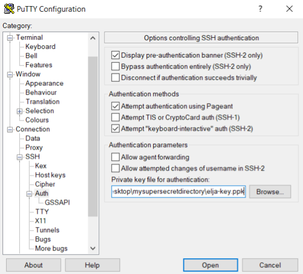
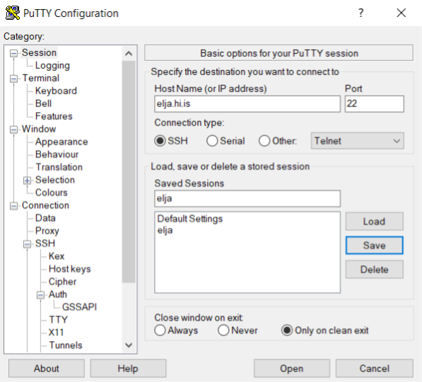

# Windows 

## PuTTygen & PuTTy

It is recommented to use PuTTy to connect to the login node Elja. 
Download PuTTy [here](https://www.putty.org/). 
Included is a tool called PuTTygen which is used to generate an SSH key-pair.

The SSH key pair generated with PuTTygen is used to securely connect to the server, 
either directly through PuTTy or when using SFTP file transfer software like 
FileZilla or Cyberduck.

### Generating an SSH-Key

Start PuTTygen - select key type RSA and increase the number of bits to 4096:

Press generate and move the mouse cursor around. 
After successfully generating a key your screen will look like this:

The public key is shown in the text box. 
Either copy and paste it into a text file, 
or save it by pressing the "Save public key" button. 
The private key (**not shown!**) needs to be saved as well. 
Press "Save private key" and place it in a directory that is out of sight 
(but easy for you to remember the location of).

:::note
It is OK to leave the passphrase empty. If you do choose a password then be aware that the key can not be used with SFTP file transfer software like FileZilla.
:::

:::caution
**Do not share the private key file, or the content of the file. 
Do not send the file, even to yourself, and 
especially not the 'admins'.**
:::

The public key needs to be shared with the admins, 
and a copy of it is made in your directory on the cluster.

### Connecting with PuTTy

Open up PuTTy and navigate to **Connection > SSH > Auth** on the left in the category panel. 
Press "Browse" next to the empty field below "Private key for authentication:" and select 
your private key (e.g. the \*.ppk generated with PuTTygen):

Navigate back to **Session** on the left and fill in "Host name" as "elja.hi.is". Type a name into
The administrator needs a copy of the public key to grant you access to the login node. 
the empty "Saved Sessions" field (for example elja) and press "Save". PuTTy will store the host information and link to the private key :

Now press "Open". You will now be connected (press "Accept" if prompted) to the login node. After enetering your username into the command prompt your screen should look like this:

You are now logged in! Welcome to Elja.

The next time you open up PuTTy just select the saved session "elja", and press open.

