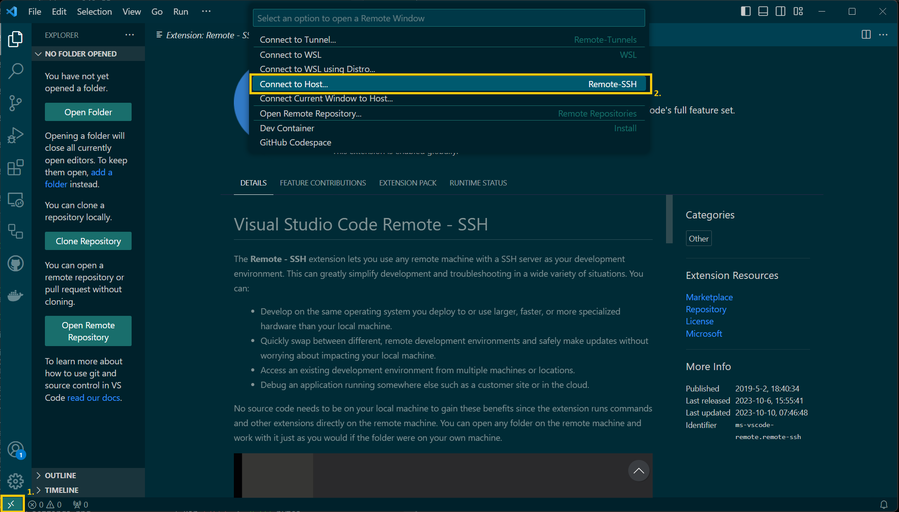
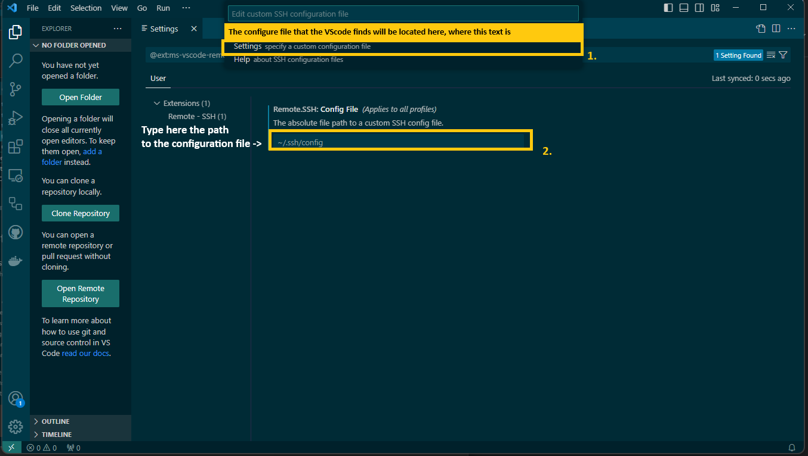
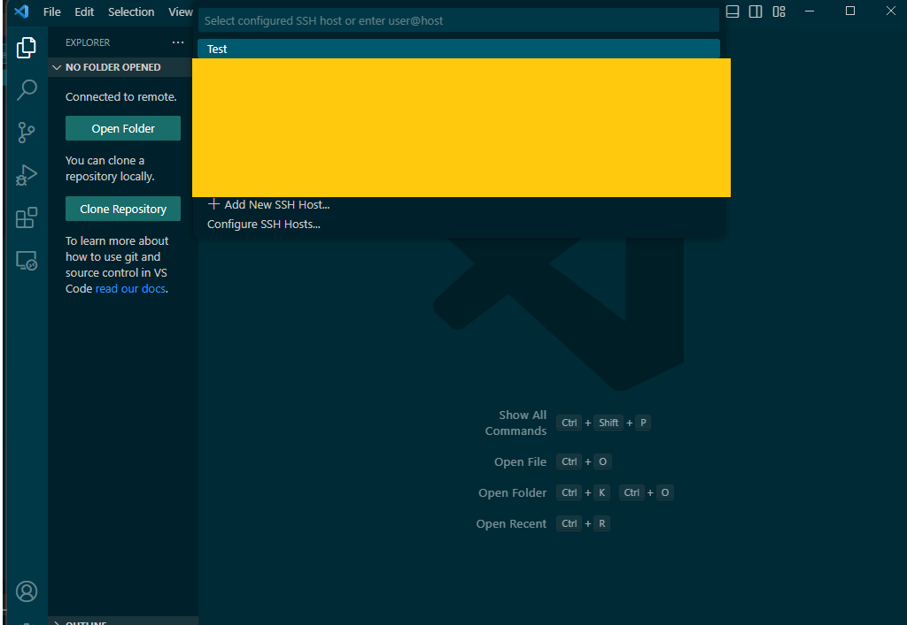
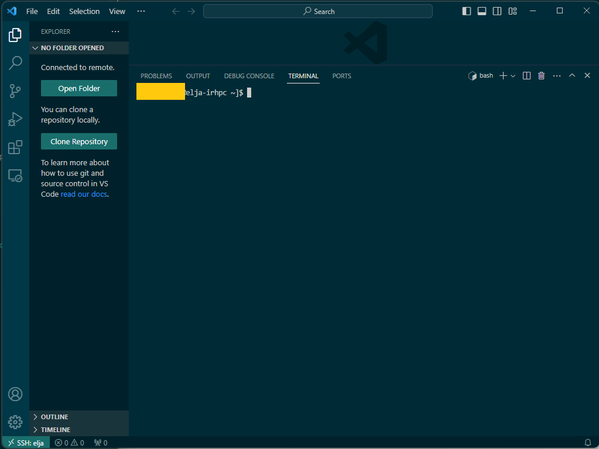

# Visual studio code

## Generating an SSH key
Generating an SSH-key can vary from system to system. To generate an SSH key in a Unix system (Mac and Linux users) you can find that in the unix section [here](02_unix.md). For windows you can get instructions to generate such a key [here](03_windows.md). 

## Setup
Before being able to connect to Elja via VScode you'll need to get an Extension called "Remote - SSH". To get this you'll need to go to the extensions tab in VScode and type in "Remote - SSH" by doing like in the following picture: 


## Create a Connection

### Connect to Host
After Installing the extension click on the button located at bottom-left corner. Clicking it should display a available types of connection. Choose ```Connect to Host...```




Now after clicking on ```Connect to Host...``` It should display ```Configure SSH Hosts```.

### Configure SSH

VScode could specify the file that it wants to use as the SSH config file. If VScode displays a config file then select it. But if it doesn't or it is not the config file that you want to use then click on ```Settings```.

In the ```Settings``` there is an input located under 
*Remote.SSH: Config Files (Applies to all profiles) The absolute file path to a custom SSH config file*. In that input location type The path of the config file.




Now go Through the whole process again. That is go to ```Connect to Host ->  Configure SSH Hosts -> SSH config file```.

Select the path that the VScode displays, that is the path to the config file that you placed in the input in the [configure section](#configure-ssh) and click on it, the configuration file should now be open in VScode.


In the Configuration file you'll need to add the information of the host, hostname, your username, and the path to the private key that is used to connect to Elja. This should look something like this:

 ```bash
 Host Test
	HostName elja.hi.is
	User <username>
	IdentityFile ~/Full/Path/To/Private/Key
 ```
After you've added these lines to the configuration file go ahead and save and exit. An exmaple on how it should be inserted into the configuration file is shown in the picture here below.


### Connect to Elja
After we've completed every step from the previous chapters we can finally go through the step to actually connect to Elja with VSCode

Click on the button on the bottom left corner, "><" and select **Connect to Host**. Now you should see the available hosts that have been retrieved from the configuration file and you should now able to see the Elja host, for this case it is called ***Test***. Click on ***Test*** and you should now be connected to Elja. 



To verify that you're connected to Elja simply open up a terminal in that VScode session and you should see "username@elja-irhpc" in the terminal window.

