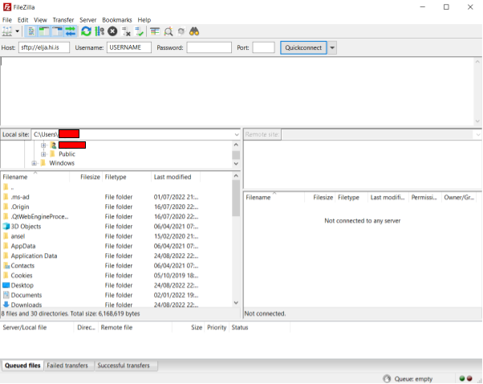
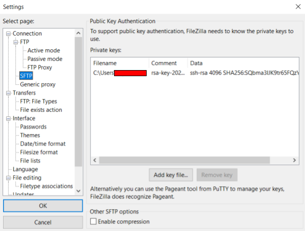
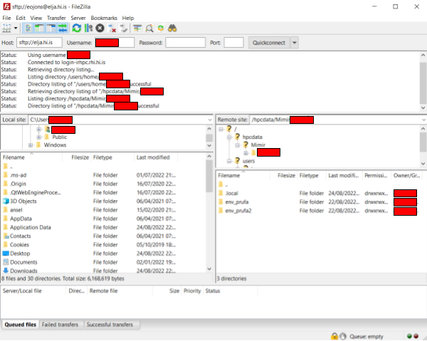
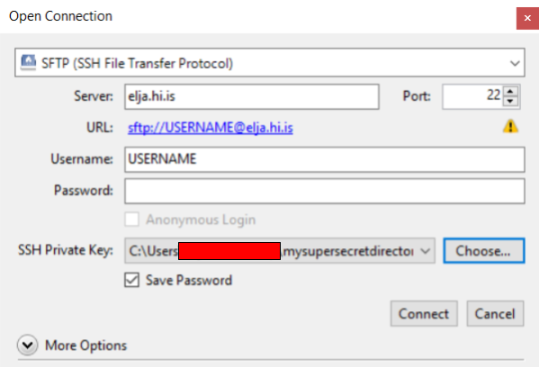
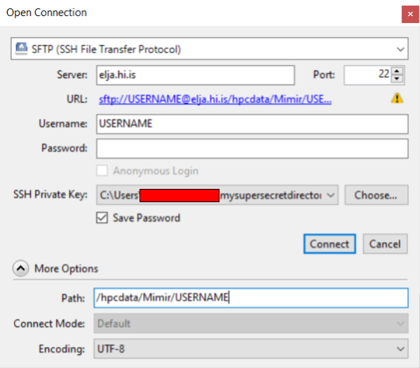
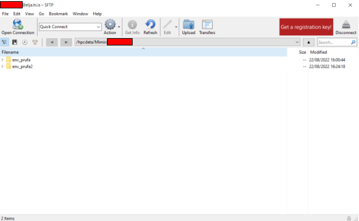

# SFTP: Cyberduck/FileZilla

The SSH key can similarly be used to connect with SSH-file-transfer-protocol 
([SFTP](https://www.ssh.com/academy/ssh/sftp)) 
software like [FileZilla](https://filezilla-project.org/) 
or [Cyberduck](https://cyberduck.io/).

:::caution
**As a courtesy to other users, do not transfer many large files at the same time. Try
only to transfer the data that you intend to use at any given time, and remember to
remove the data and files you are finished working with. You are sharing the bandwith 
and disk space with your fellow colleagues and other scientists.** 
:::

## FileZilla

Open up **FileZilla** and enter your username and "sftp://elja.hi.is" as host:

Open the settings menu in **Edit > Settings**. Navigate to **Connection > FTP > SFTP**.
Press "Add key file" and select the private key (e.g. the \*.ppk generated with PuTTygen):

Press "Quickconnect" and choose "Always trust the host" when prompted. 
A successfull connection looks like this (for test user **redacted**):

## Cyberduck

:::note
This has been tested for Cyberduck version **8.4.3**. It is recommended you upgrade to at
least this version or later (some earlier versions have a problem maintaining the connection).
:::

Open Cyberduck and press "Open Connection" in the top left corner. Fill in the fields like this:

For **Mimir-II** users; you can go directly to your **/hpcdata/Mimir/USERNAME** directory like this:

Press connect.

A successfull connection looks like this:

