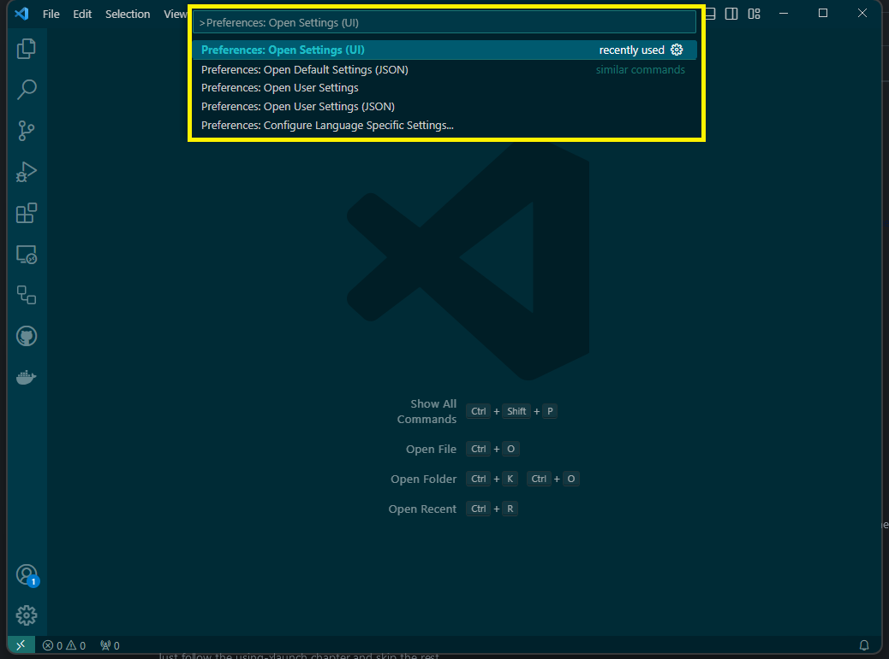
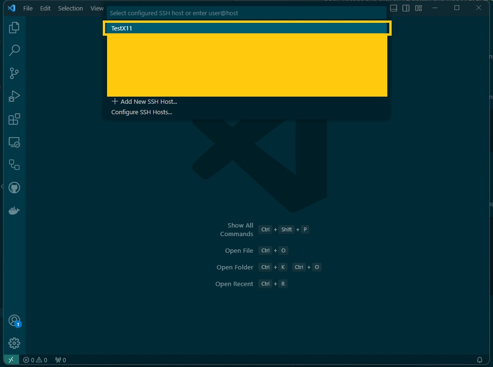
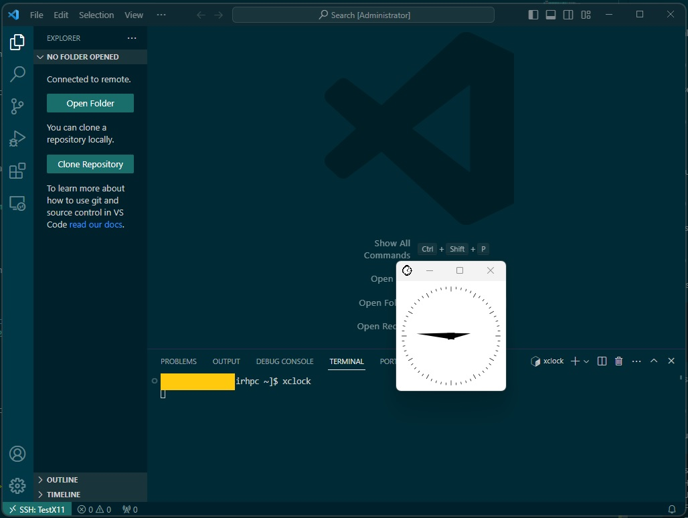

# Visualization
Some large datasets may on occasion need to be visualized in place, on the cluster. For these situations, the user has several options which are detailed below.

## SSH
The most common approach to visualization is by connecting to the server with a flag to set the `X11` forwarding details. The most common ones are:

```bash
ssh -X someone@something.ip.address # ForwardX11
ssh -Y someone@something.ip.address # ForwardX11Trusted
```

However, a more practically useful method is to modify the `ssh` configuration file itself. The following snippet can be added:

```conf
Host *
  ForwardAgent yes
  ForwardX11 yes
  ForwardX11Trusted yes
  XAuthLocation /opt/X11/bin/xauth # For a Mac with XQuartz
```

For Linux (and Windows with WSL 2) machines, `which xauth` will provide the path for the `XAuthLocation` variable. Now the user is free to connect directly:

```bash
ssh someone@something.ip.address # Reads the ssh configuration
```

A quick test to see if X forwarding is working is to type
```bash                                       
xclock
```
which should open up a small clock gui showing the local time.

## Using PuTTy
PuTTy also offers a visualisation method when connecting to the server. This is done by using the Putty application and another software called Xming which can be retrieved [here](https://sourceforge.net/projects/xming/files/Xming/6.9.0.31/Xming-6-9-0-31-setup.exe/download), though othere softwares could also be used but we will be usign Xming for in this case.


### Using XLaunch
When you've installed XMing find the application called 'XLaunch' and run it. The following window should pop up.  
:::note
Display number does not need to be -1 as in the image above, it can be the default of 0.
:::


Choose **Multiple windows** and click on '**Next >** and a new page will appear that goes through the **Session Type**.


On the **Session Type** choose **start no client** and click on **Next** and you should be prompted to the **Additional parameters** section.


There choose only the **Clipboard** option and press **Next >** and that will move you to **Finish Configuration**
:::note
On newer versions of XLaunch you can only select clipboard and not "Native opengl" it is important that you set the environment variable export LIBGL_ALWAYS_INDIRECT=1.
You can add it to your .bashrc file with the following command 'echo "export LIBGL_ALWAYS_INDIRECT=1" >> $HOME/.bashrc'
:::


on that site you only need to click on **Finish**


### Configuring PuTTY for X11
First step would be to open PuTTy and load a session.To do this you should automatically be moved to the **Session** section once you run *PuTTy*. Then click on the *session* and then the **Load** button.


Go to **Connection** -> **SSH** -> **X11** and  choose **Enable X11 Forwarding** and set the **X dispaly location** to **localhost:0.0** aswell as selecting **MIT-Magic-Cookie-1** in **Remote X11 authentication protocol**. If you've done everything correctly it should look something like this:


### Check for Result
Once you've setup X11 and connected to elja the next step is to check whether it succeeded. To do this simply type in the command line on elja ```xclock```. This command should make a clock appear on your screen like the screenshot shows here below. 


## Using VScode
Many Users use VScode to connect to Elja but it might be a difficult process to enable visualisation through VScode. Here are instructions to enable xforwarding (visualisation)

### Step 1
First set up XLaunch to enable xforwarding. You can follow the instructions in this chapter [here](#using-xlaunch) To complete this step.

### Step 2
Open VScode and click on ```F1``` button and type ```Preferences: Open Settings (UI)```



### Step 3
Now search for ```terminal.integrated.env.windows``` and click on ```Edit in settings.json``` like shown in the picture below.


### Step 4
After step 3 vscode should open a ```settings.json``` file. In there add the following:


```bash
    "terminal.integrated.env.windows": {    
        "DISPLAY": "127.0.0.1:0.0"
    },
```
then save and exit.

### Step 5 
In your SSH configuration,varying but mostly common to be in the location ```.ssh/config``` file, add in there the following

```bash
Host TestX11 #changeable
  HostName elja.hi.is
  User <YOUR_USERNAME>
  ForwardAgent yes
  ForwardX11 yes
  ForwardX11Trusted yes
  IdentityFile <location of private key>
```
### Step 6
***This step requires the user to have the extension remote-SSH.***

Connect to Elja by clicking on the green button at the button corner and click on *connect to Host...* like the following picture shows.


and then like in the next picture click on the name of The 'HOST', in this case ```TestX11``` you want to connect to.



### Step 7
Once you've managed to connect to Elja you can check if the xforwarding is working by typing into the terminal ```xclock``` like this picture shows: 


# Visualization on computational nodes
X11 forwarding is available on the compute and GPU nodes of *Elja*.
To use this feature a few steps must be taken to create a "double tunnel" that looks something like this 
```bash
compute-node -> login-node -> local-machine
```

1. First you must connect with the -XY as stated above or using XLaunch with PuTTy as stated below.
2. You must allocate a node with slurm 
:::note Due to a problem with slurm the --x11 flag for srun is not available at the moment. We are working on fixing this issue :::


```bash
salloc -n 1 --partition 48cpu_192mem  # This will allocate a node for you, salloc can use the same flags as srun and batch scripts.
ssh -XY $SLURM_NODELIST               # You will now connect to the compute node with an X11 tunnel.
```

This will allow you to run graphical interfaces on our compute nodes that you can view on your local machine.


