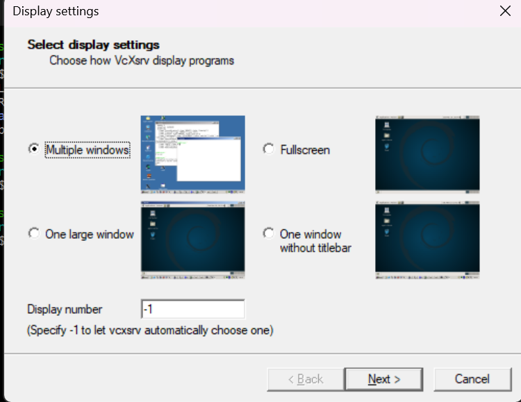
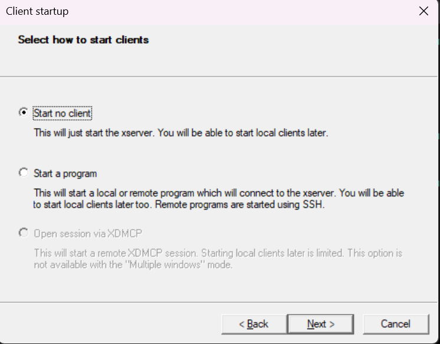
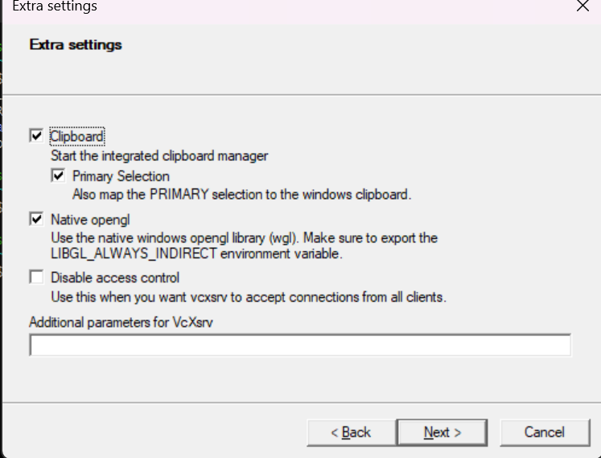
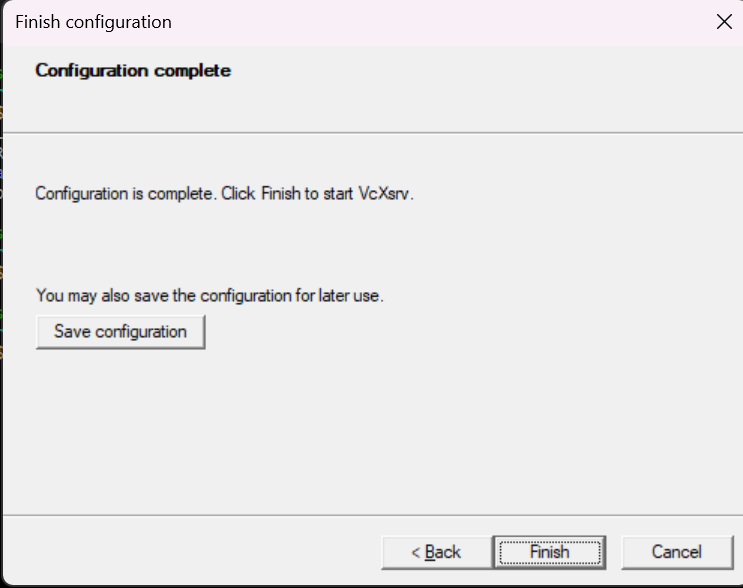
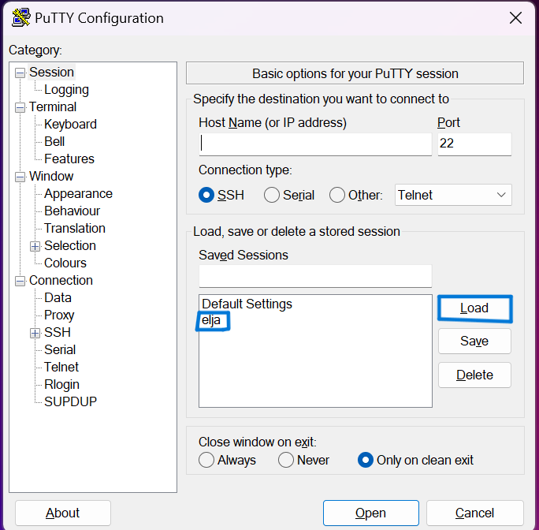
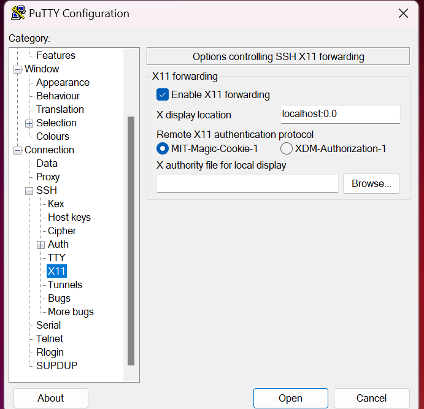
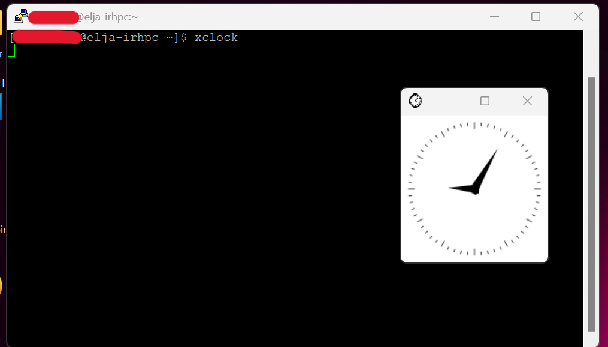

# Visualization
Some large datasets may on occasion need to be visualized in place, on the cluster. For these situations, the user has several options which are detailed below.

## SSH
The most common approach to visualization is by connecting to the server with a flag to set the `X11` forwarding details. The most common ones are:

```bash
ssh -X someone@something.ip.address # ForwardX11
ssh -Y someone@something.ip.address # ForwardX11Trusted
```

However, a more practically useful method is to modify the `ssh` configuration file itself. The following snippet can be added:

```conf
Host *
  ForwardAgent yes
  ForwardX11 yes
  ForwardX11Trusted yes
  XAuthLocation /opt/X11/bin/xauth # For a Mac with XQuartz
```

For Linux (and Windows with WSL 2) machines, `which xauth` will provide the path for the `XAuthLocation` variable. Now the user is free to connect directly:

```bash
ssh someone@something.ip.address # Reads the ssh configuration
```

A quick test to see if X forwarding is working is to type
```bash                                       
xclock
```
which should open up a small clock gui showing the local time.

## Using PuTTy
PuTTy also offers a visualisation method when connecting to the server. This is done by using the Putty application and another software called Xming which can be retrieved [here](https://sourceforge.net/projects/xming/files/Xming/6.9.0.31/Xming-6-9-0-31-setup.exe/download), though othere softwares could also be used but we will be usign Xming for in this case.


### Using XLaunch
When you've installed XMing find the application called 'XLaunch' and run it. The following window should pop up.  



Choose **Multiple windows** and click on '**Next >** and a new page will appear that goes through the **Session Type**.




On the **Session Type** choose **start no client** and click on **Next** and you should be prompted to the **Additional parameters** section.




There choose only the **Clipboard** option and press **Next >** and that will move you to **Finish Configuration**




on that site you only need to click on **Finish**


### Configuring PuTTY for X11
First step would be to open PuTTy and load a session.To do this you should automatically be moved to the **Session** section once you run *PuTTy*. Then click on the *session* and then the **Load** button.



Go to **Connection** -> **SSH** -> **X11** and  choose **Enable X11 Forwarding** and set the **X dispaly location** to **localhost:0.0** aswell as selecting **MIT-Magic-Cookie-1** in **Remote X11 authentication protocol**. If you've done everything correctly it should look something like this:



### Check for Result
Once you've setup X11 and connected to elja the next step is to check whether it succeeded. To do this simply type in the command line on elja ```xclock```. This command should make a clock appear on your screen like the screenshot shows here below. 

