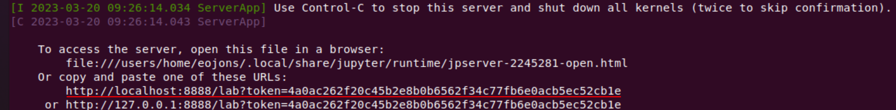
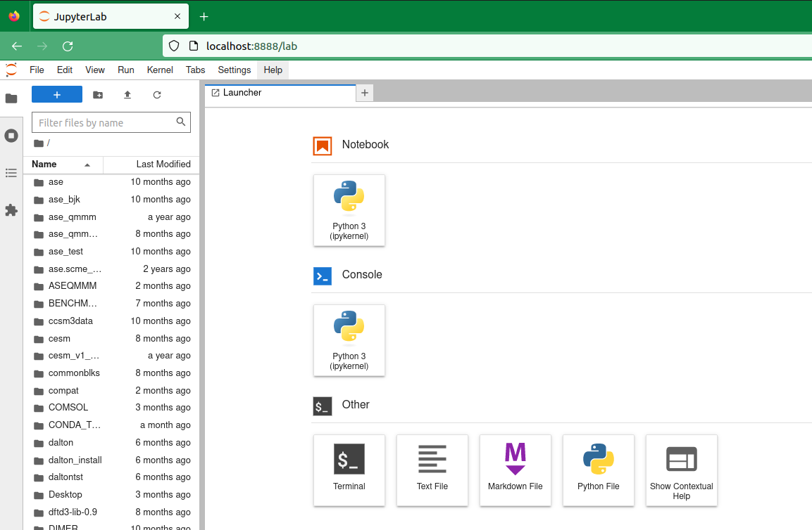

# Jupyterlab á Elja

Þessar leiðbeiningar sýna þér hvernig á að setja upp **vafralaust** Jupyterlab á reiknihnút, 
og hvernig á ád tengjast honum með vafra frá staðbundinni tölvu. Þetat er gert í fjórum skrefum. 
and how to connect to it with a browser on your local computer. This is accomplished in four steps.


Eftir farandi leiðbeinangar virka á Linx/MacOS kerfum. Munið að breyta **<uname\>** í notandanafnið þitt.

### 1) Stja upp Jupyterlab með Conda:
Skráðu þig inn á **Elju** og settu upp **Jupyterlab** umhverfið þitt með **conda**.

```bash
[..]$ module load Anaconda3/2022.05
[..]$ conda create -y -p $HOME/conda/env_jupyter
[..]$ conda activate $HOME/conda/env_jupyter
[..]$ conda install -c conda-forge jupyterlab
```

:::note
Það er mikilvægt að smíða alla pakka á **innskráningarhnútinum** áður en umhverfið er keyrt á **reiknihnút**
:::

Í þessu dæmi setjum við upp **Python** og **tsne** pakkana fyrir **Jupyterlab** umhverfið.

```bash
[..]$ conda install python=3.9
[..]$ pip install --upgrade pip wheel setuptools
[..]$ pip install jupyter
[..]$ conda install -c conda-forge tsne
```

### 2) Opna gagnvirka keyrslu og keyra Jupyterlab Bókina.

In this example 24 cores of a compute node from partition **<pname\>** is requested with 3.9**Gb** per core.


```bash
$ srun --job-name "Jupyterlab" --partition <pname> --cpus-per-task 24 --mem-per-cpu 3900 --time 1-00:00:00 --pty bash
```

:::note
Það er mikilvægt að stilla fjölda kjarna (og minni á hvern kjarna) eftir þínum þörfum! Ekki úthluta óþarfa vinnsluorku. Sjá [hér](../hardware/01_partitions.md) fyrir skiptingu og forskriftir.
:::

Virkjaðu **jupyterlab** umhverfið

```bash
[<uname>@compute-\#]$ module load Anaconda/2022.05
[<uname>@compute-\#]$ conda activate $HOME/conda/env_jupyter
```

Settu upp **jupyterlab minnisbók** á hnútinn, án vafra

```bash
[<uname>@compute-\#]$ jupyter-lab --port 8888 --no-browser
```

There will be a lot of output, but the important output is the second to last **jupyterlab url** underlined here:



### 3) Stofnaðu göng að reiknihnútnum

Opnaðu nýjan skipanaglugga á tölvunni þinni og stofnaðu tvöföld göng

```bash                                                                    
[..]$ ssh -t -t <uname>@elja.hi.is -L 8888:localhost:8888 ssh compute-\# -L 8888:localhost:8888
```

Athugaðu að **compute-\#** verður að passa við nafn og númer reiknihnútsins sem úthlutað er fyrir gagnvirku keyrsluna.

Skildu skipanagluggan eftir opinn og opnaðu vafra á tölvunni þinni.


### 4) Opnaðu Jupyterlab-Notebook á tölvunni þinni

Þú getur nú opnað vafra á tölvunni þinni og afritað **jupyterlab slóðina** í vafrann þinn:


Ýttu á enter og **jupyterlab minnisbókin þín**, sem keyrir á tölvuhnútnum, er nú virk í staðbundnum vafra þínum:



:::note
Það getur gerst að gáttin **8888** sé upptekin einhvers staðar á kerfi. Í þessu tilfelli skaltu einfaldlega velja annað (svipað) gáttarnúmer, til dæmis **8889**, og byrja aftur á því að virkja **jupyter-lab minnisbók**, síðasta hluta skrefs **2)**, fylgt eftir með endurtekningu af skrefum **3)** og **4)**
:::


