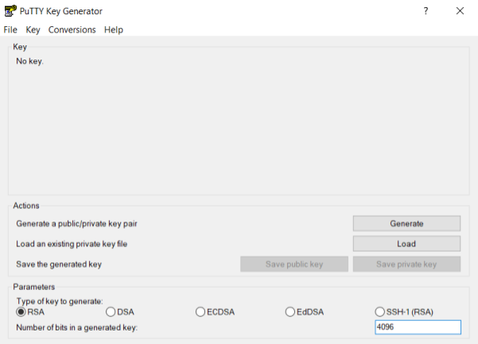
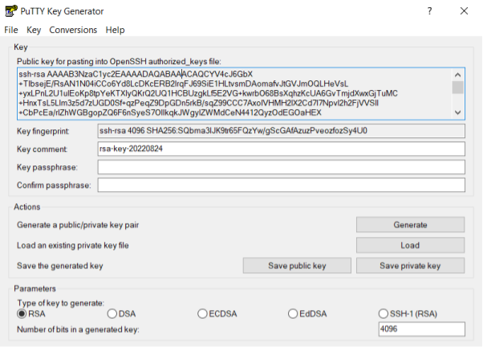
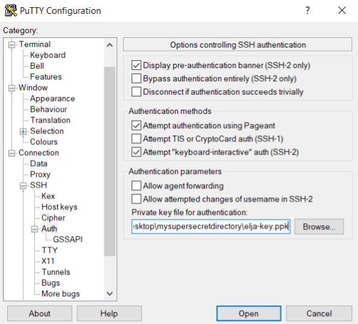
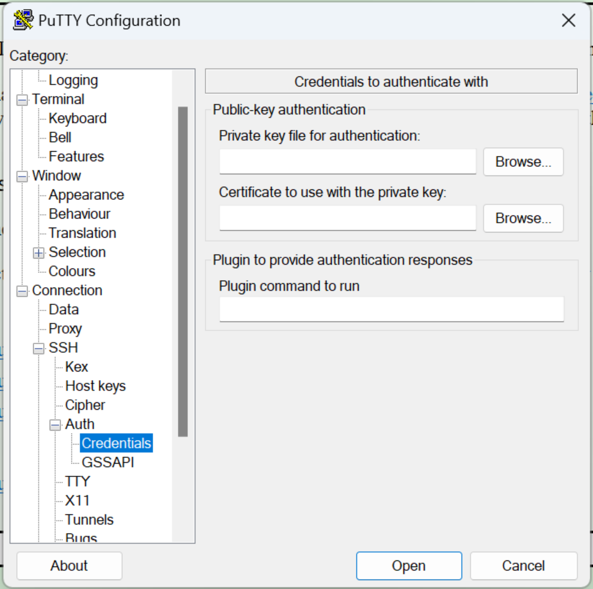
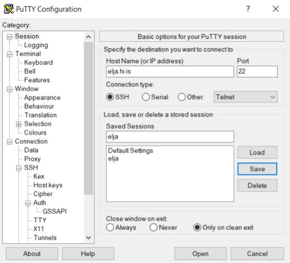
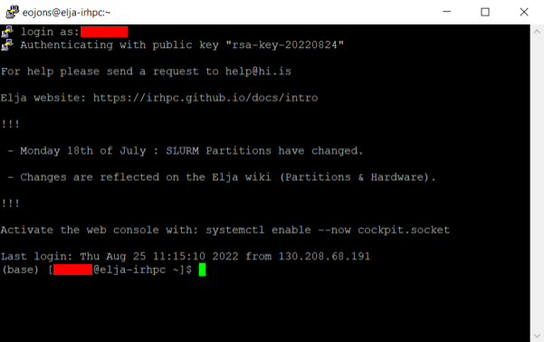

# Windows 

## PuTTygen & PuTTy

Mælt er með því að nota PuTTy til að tengjast innskráningarhnútnum Elju.
Sæktu PuTTy [hér](https://www.putty.org/).
Innifalið er tól sem kallast PuTTygen sem er notað til að búa til SSH lyklapar.

SSH lyklaparið sem er búið til með PuTTygen er notað til að tengjast þjóninum á öruggan hátt,
annað hvort beint í gegnum PuTTy eða þegar þú notar SFTP skráaflutningshugbúnað eins og
FileZilla eða Cyberduck.


### Búa til SSH-lykil

Byrjaðu PuTTygen - veldu lykiltegund RSA og fjölgaðu bitafjölda í 4096:



Ýttu á ```Generate``` og hreyfðu músarbendilinn í kring.
Eftir að þú hefur búið til lykil mun skjárinn líta svona út:



Opinberi lykillinn er sýndur í textareitnum.
Annað hvort afritaðu hann inn í textaskrá,
eða vistaðu það með því að ýta á "Save public key" hnappinn.
Einnig þarf að vista einkalykilinn (**ekki sýndur!**).
Ýttu á "Save private key" og settu hann í möppu sem er ekki í augsýn
(en auðvelt fyrir þig að muna staðsetningu).

:::note
Það er í lagi að skilja lykilorðið eftir tómt. Ef þú velur lykilorð skaltu hafa í huga að lykillinn er ekki hægt að nota með SFTP skráaflutningshugbúnaði eins og FileZilla.
:::

:::caution
**Ekki deila einkalyklaskránni, eða innihaldi skráarinnar.
Ekki senda skrána, jafnvel til þín, og
sérstaklega ekki 'admins'.**
:::

Opinbera lyklinum þarf að deila með stjórnendum,
og afrit af því er gert í möppunni þinni á klasanum.

### Skilríki í PuTTy

Opnaðu PuTTy og farðu í **Connection > SSH > Auth** vinstra megin í flokkaspjaldinu.
Ýttu á "Browse" við hliðina á auða reitnum fyrir neðan "Private key for authentication:" og veldu
einkalykillinn þinn (t.d. \*.ppk sem er búinn til með PuTTygen):



:::note
Í síðari útgáfum af PuTTy má finna reitinn „Private key for authentication“ í **Connection > SSH > Auth > Credentials**. Sjá mynd hér að neðan.
:::



### Geyma lotuna og tengjast

Farðu aftur í **Session** vinstra megin og fylltu út "Host name" sem "elja.hi.is". Sláðu inn nafn í tóma „Vistar lotur“ reitinn (til dæmis elja) og ýttu á „Vista“. PuTTy mun geyma upplýsingar um hýsingaraðila og tengja við einkalykil
Kerfisstjórinn þarf afrit af opinbera lyklinum til að veita þér aðgang að innskráningarhnútnum.



Ýttu nú á "Open". Þú verður nú tengdur (ýttu á "Accept" ef beðið er um það) við innskráningarhnútinn. Eftir að þú hefur slegið inn notandanafnið þitt í skipanalínuna ætti skjárinn þinn að líta svona út:



Þú ert núna skráður inn! Verið velkomin á Elju.

Næst þegar þú opnar PuTTy skaltu bara velja vistuðu lotuna „elja“ og ýta á opna.