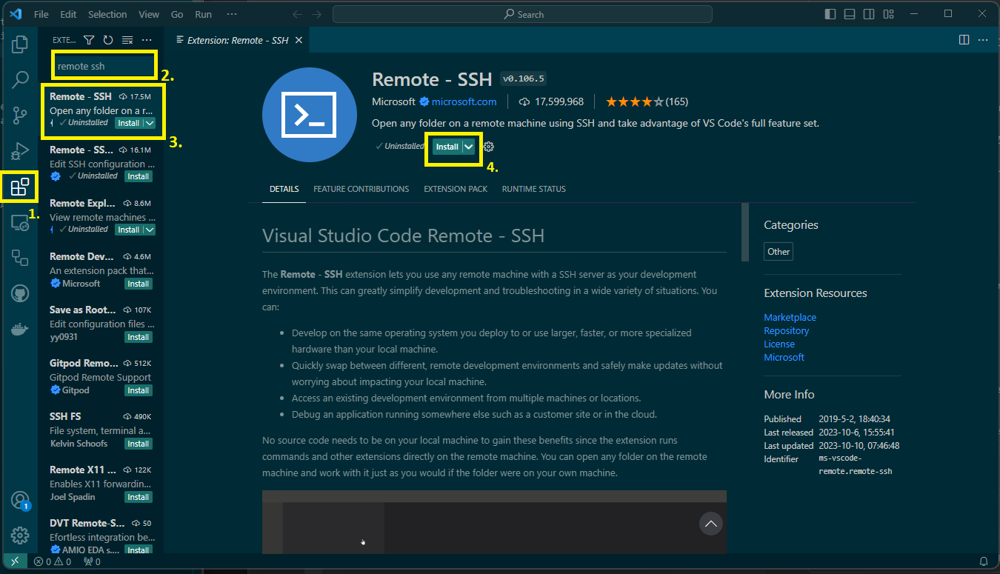
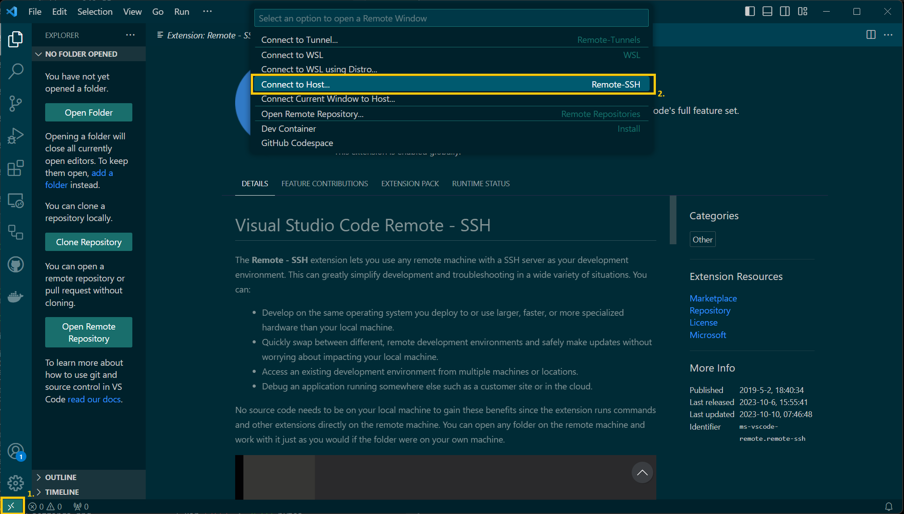
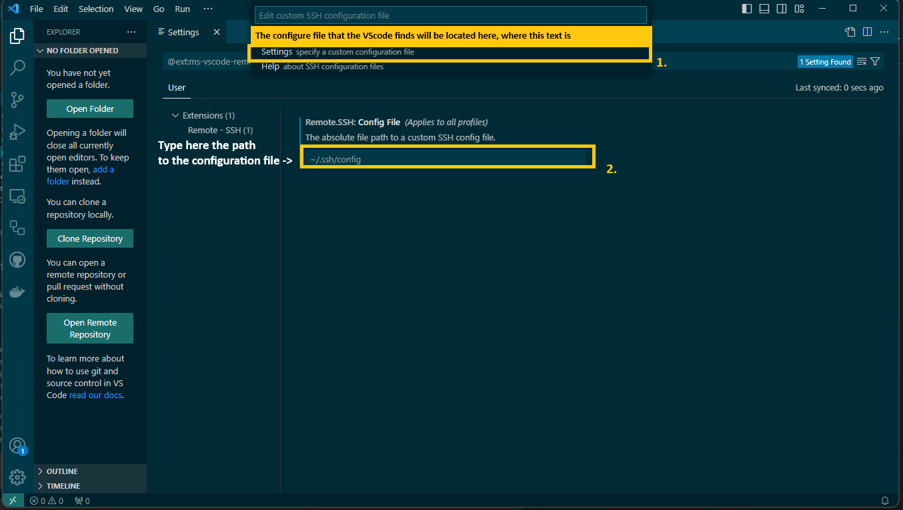
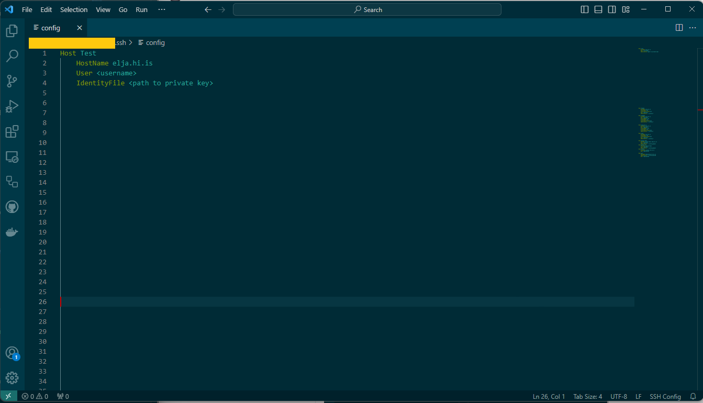
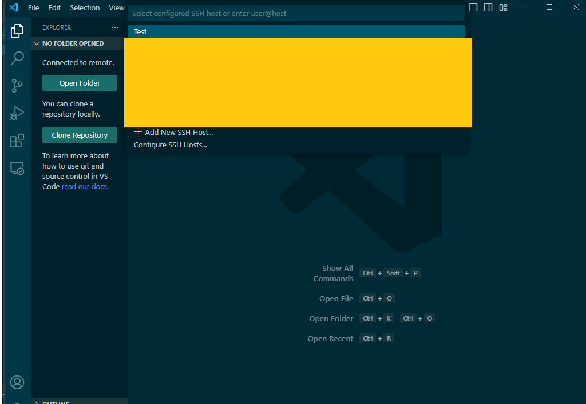
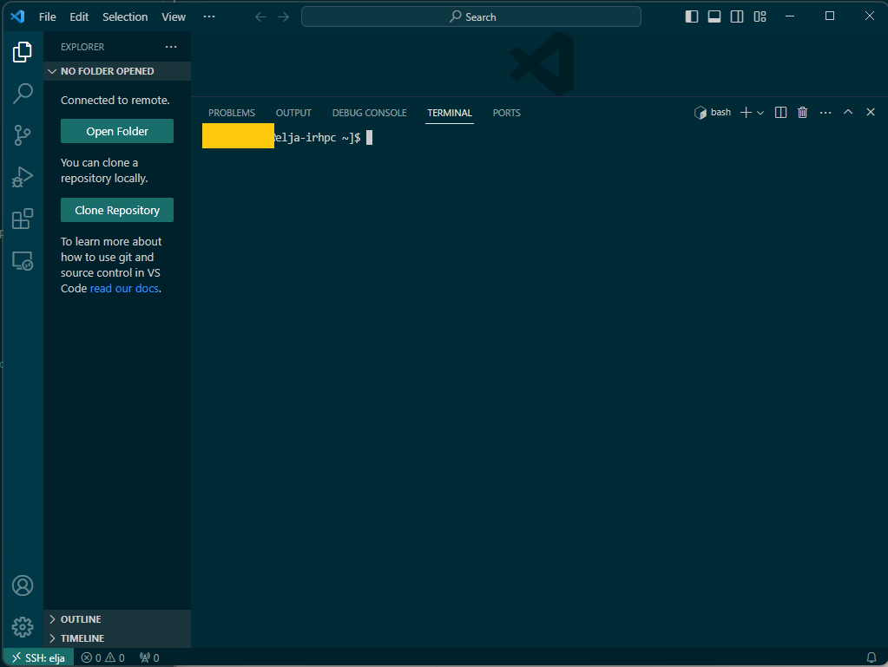

# Visual studio code

## Stofna Lykil

Að stofna SSH lykil getur verið mismunandi útfrá hvaða stýrikerfi er verið nota.  Til þess að stofna SSH lykil í gegnum Unix kerfi (Mac og Linux) þá eru leiðbeiningar til þess að gera það [hér](02_Unix.md). Fyrir windows þá eru leiðbeiningar til þess að búa til SSH lykil  [hér](03_windows.md)

## Uppsetning
Áður en það er hægt að tengjast Elju í gegnum VScode þá þarf að setja upp "Extension" sem heitir "Remote -SSH". Til þess að geta fengið það extension þá þarf að fara í extensions flipan inn í VScode og skrifa í leitarvélinni "Remote -SSH". Meðfylgjandi mynd sýnir hvernig ferlinu er háttað.





## Stofna tengingu

### Tengjast þjóninum

Eftir að 'Remote - SSH' sé búið að hlaðast inn smelltu á hnappinn í vinstra horninu. Sá hnappur ætti að birta upp flipa sem inniheldur ```Connect to Host``` og smelltu á það.




Eftir að það er búið að smella á ```Connect to Host...``` þá ætti það að birta upp ```Configure SSH Hosts```.

### Configure SSH

í ```Configure SSH Hosts``` þá getur VScode komið upp með tillögu á config skrá til þess að geyma upplýsingar um SSH lykla. Ef það gerist þá getur þú notað þessa SSH skrá en ef þú villt velja aðra config skrá þá getur þú gert það í ```Settings```. 


Í ```Settings``` þá getur þú skrifað inn staðsetninguna á config skránni sem þú villt velja og er staðsett fyrir neðan 
*Remote.SSH: Config Files (Applies to all profiles) The absolute file path to a custom SSH config file*. Í þeirri staðsetningu skrifaðu inn staðsetninguna á config skránni.



Þegar þú ert búinn að velja config skránna þá þarftu að gera það sama aftur, þ.e. fara í gegnum ```Connect to Host ->  Configure SSH Hosts -> SSH config file```. 

Núna ætti VScode að gefa upp staðsetninguna á config skránni sem þú settir í ```Settings``` og smelltu á þann valmöguleika. Þetta ætti að opna config skránna. 


Í configuration skránni þá þarftu að bæta upplýsingum um þjónin sem þú villt tengjast. Þær upplýsingar þurfa að vera nafnið á þjóninum, notendanafnið þitt á þjóninum og staðsetningin á SSH lyklinum þínum sem veitir þér aðgang að þjóninum. 

Þetta ætti að líta út eins og hér fyrir neðan:
 ```bash
 Host Test
	HostName elja.hi.is
	User <username>
	IdentityFile ~/Full/Path/To/Private/Key
 ```

 Efitr að þú ert búinn að bæta þessum línum við í config skránna þá getur þú vistað og lokað þessum glugga. Hér fyrir neðan er mynd sem sýnir dæmi um hvernig þetta ætti að vera uppsett.



### Tengjast Elju

Eftir að þú ert búinn að fara í gegnum öll þessi skref þá getum við loksins farið í gegnum ferlið á að tengjast Elju með VScode.

Eins og í fyrri köflum byrjaðu á að smella á hnappinn sem er staðsettur í vinstra-horninu. Smelltu síðan á **Connect to Host**. Núna ættir þú sjá alla mögulega þjóna sem hefur verið sett upp tengingu í gegnum config skránna þína og þú ættir núna að geta séð Elju þjónin, sem við skýrðum í þessu tilfelli ***Test***. Smelltu á ***Test*** og þú ættir núna vera tengdur við Elju.




Til þess að staðfesta að þú sért búinn að tengjast Elju þá getur þú einfaldlega opnað nýtt 'terminal' í nýja VScode glugganum og þú ættir að sjá "username@elja-irhpc" eins og hægt er að sjá á myndinni hér fyrir neðan.

