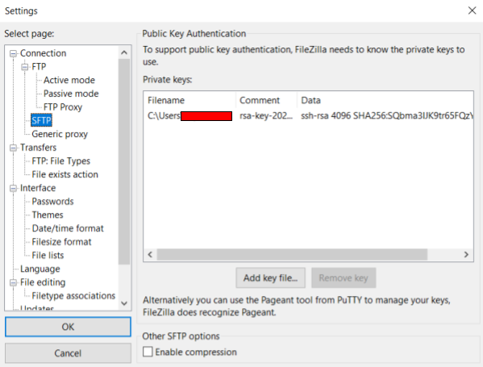
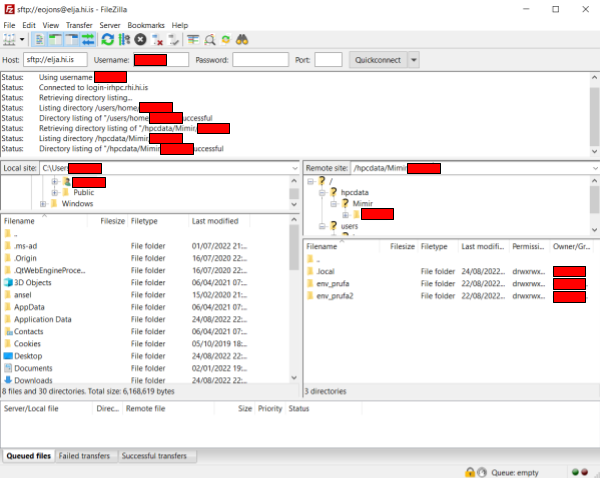
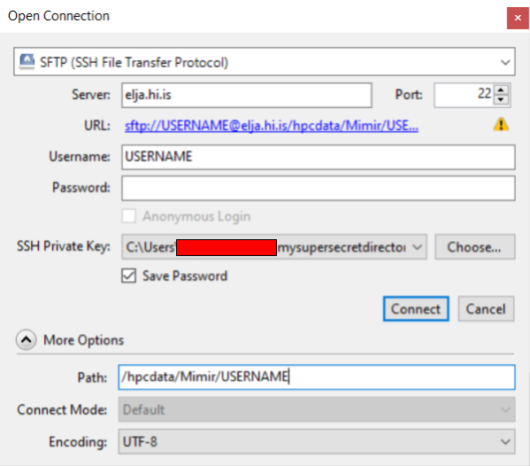
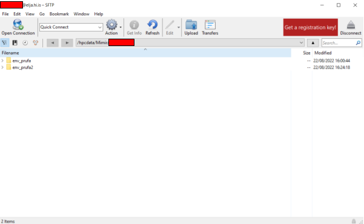

# SFTP: Cyberduck/FileZilla

SSH lykilinn er á sama hátt hægt að nota til að tengjast SSH-skráaflutnings-samskiptareglum
([SFTP](https://www.ssh.com/academy/ssh/sftp))
hugbúnaður eins og [FileZilla](https://filezilla-project.org/)
eða [Cyberduck](https://cyberduck.io/).

:::caution
**Sem kurteisi við aðra notendur, ekki flytja margar stórar skrár á sama tíma. Reyndu
aðeins til að flytja þau gögn sem þú ætlar að nota hverju sinni og mundu eftir því
fjarlægðu gögnin og skrárnar sem þú ert búinn að vinna með. Þú ert að deila bandbreiddinni
og pláss á plássi með félögum þínum og öðrum vísindamönnum.**
:::

## FileZilla

Opnaðu **FileZilla** og sláðu inn notendanafnið þitt og "sftp://elja.hi.is" sem host:

Opnaðu stillingavalmyndina í **Edit > Settings**. Farðu í **Connection > FTP > SFTP**.
Ýttu á „Add key file“ og veldu einkalykilinn (t.d. \*.ppk sem er búið til með PuTTygen):

Ýttu á "Quickconnect" og veldu "Always trust the host" þegar beðið er um það.
Vel heppnuð tenging lítur svona út (fyrir prófnotanda **fjarlægt**):

## Cyberduck

:::note
Þetta hefur verið prófað fyrir Cyberduck útgáfu **8.4.3**. Mælt er með því að uppfæra í kl
að minnsta kosti þessa útgáfu eða síðar (sumar fyrri útgáfur eiga í vandræðum með að viðhalda tengingunni).
:::

Opnaðu Cyberduck og ýttu á "Open Connection" efst í vinstra horninu. Fylltu út reitina svona:

Fyrir notendur **Mimir-II**; þú getur farið beint í **/hpcdata/Mimir/USERNAME** möppuna þína svona:

Ýttu á connect.

Vel heppnuð tenging lítur svona út:

