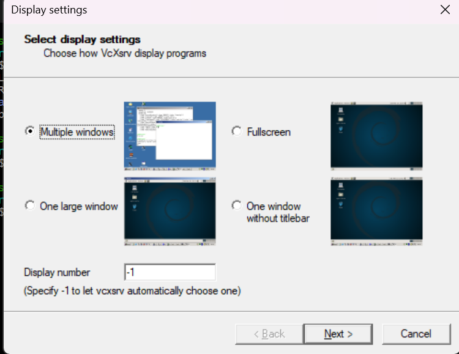
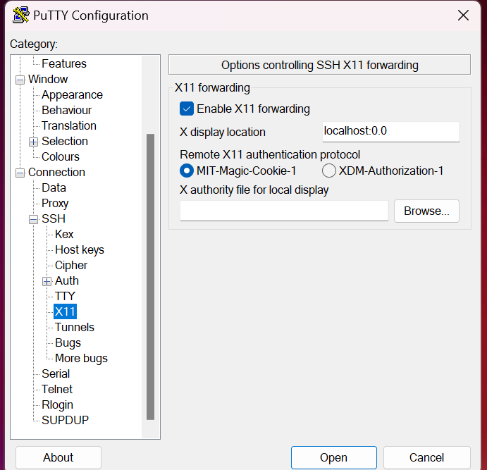
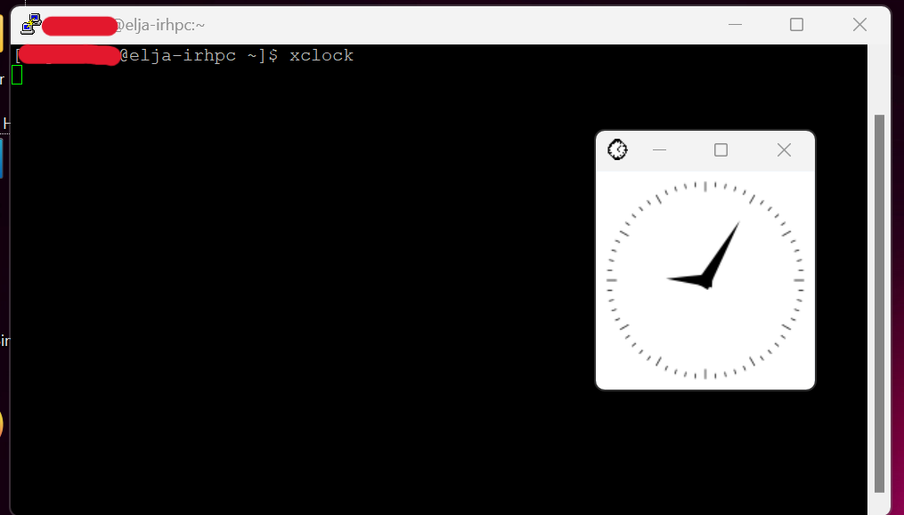

# Myndrænt

Sum stór gagnasöfn er oft gott að geta séð myndrænt. Fyrir þessar aðstæður hafa notendur nokkra möguleika sem útskýrðir eru hér að neðan. 

## SSH
Algengasta nálgunin við myndrænni keyrslu er með því að tengjast zjóninum med fána sem stillir `X11` áframsendingar. Algengast er:

```bash
ssh -X someone@something.ip.address # ForwardX11
ssh -Y someone@something.ip.address # ForwardX11Trusted
```

Hins vegar er hagnýtari aðferð að breyta "ssh" stillingarskránni sjálfri. Hægt er að bæta við eftirfarandi broti:

```conf
Host *
  ForwardAgent yes
  ForwardX11 yes
  ForwardX11Trusted yes
  XAuthLocation /opt/X11/bin/xauth # For a Mac with XQuartz
```

Fyrir Linux (og Windows meD WSL2) vélar mun `which xauth` gefa slóðina fyrir `XAuthLocation` breytuna. Nú er natnda frjálst að tengjast beint:

```bash
ssh someone@something.ip.address # Reads the ssh configuration
```

Fljótlegt próf til að sjá hvort X-framsending virkar er ad slá inn:
```bash                                       
xclock
```
Sem ætti að opna litla klukku sem sýnir staðartíma.

## Með PuTTy
PuTTy bíður einnig uppá birta forrit myndrænt inná elju. Þetta er gert með tveimur forritum, PuTTy og Xming sem er hægt að sækja [hér](https://sourceforge.net/projects/xming/files/Xming/6.9.0.31/Xming-6-9-0-31-setup.exe/download), þó það er hægt að nota önnur forrit sem gera sama hlutinn en í þessu tilfelli verður notað Xming.


### Nota XLaunch
Þegar þú ert búinn að setja upp Xming leitaðu þá að forritinu  'XLaunch' og  keyrðu það. Þegar þú ert búinn að því þá ætti efitrfarandi gluggi að birtast.




Veldu **Multiple windows** og smelltu á **Next >** og nýj síða mun birtast sem fer í gegnum ***Session Type**.


á **Session Type** veldu **start no client** og smelltu á **Next** og þér ætti að verða beint á síðuna **Additional parameters**


Á þeirri síðu hakaðu aðeins við **Clipboard** og smelltu á **Next >** og það mun að lokum færa þig á **Finish Configuration** sem ætti að líta eftirfarandi út.


á þessari síðu þá þarftu aðeins að smella á **Finish**

### Setja upp stillingar í PuTTY fyrir X11
Fyrsta skrefið er að opna PuTTy og hlaða inn **Session**. Til þess að gera það þá þarftu klikka á *Session* í **Session** flipanum  og smella á **Load** hnappinn.


Fara yfir **Connection** -> **SSH** -> **X11** og veldu **Enable X11 Forwarding**,setja **X display location** í **localhost:0.0** og að auki velja **MIT-Magic-Cookie-1** í **Remote X11 authentiucation protocol**. Ef þú hefur gert allt á rétt þá ætti þetta að líta eins og má sjá á myndinni hér fyrir neðan.



### Check for Result
Þegar þú hefur sett upp X11 og tengst elju þá væri næsta skrefið að athuga hvort að þessi uppsetning hafi tekist. Til þess að gera það þá einfaldlega skrifaðu inn í command línuna á elju ```xclock```. Þessi skipun ætti að birta klukku sem birtir local tímann eins og má sjá á meðflygjandi mynd 

